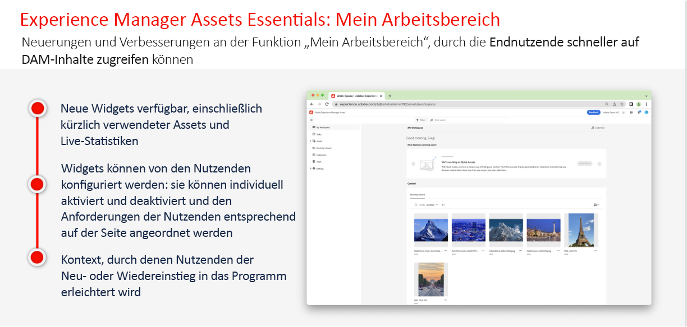
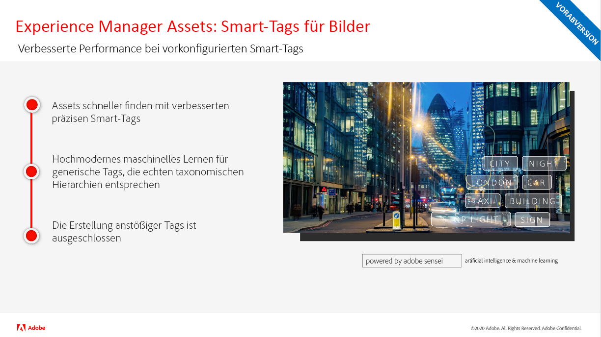
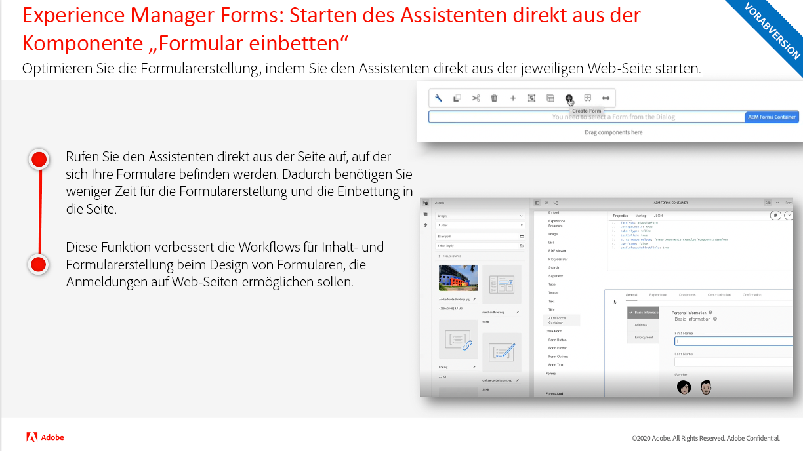
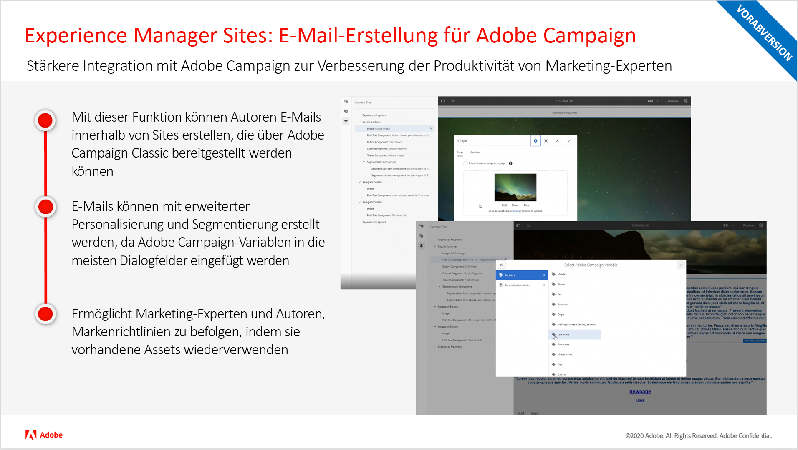
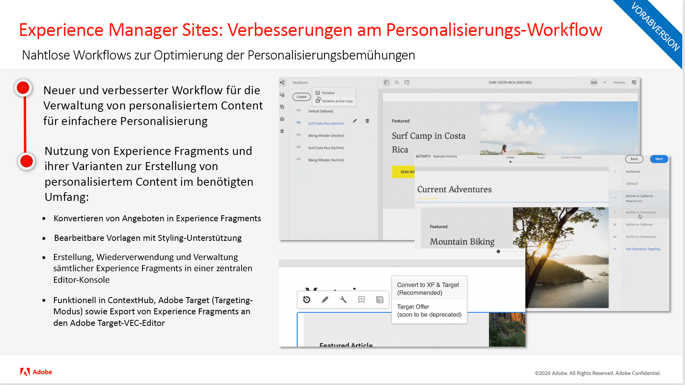
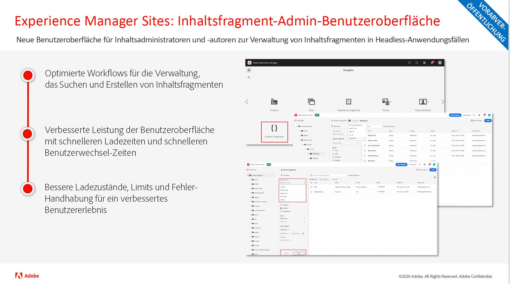
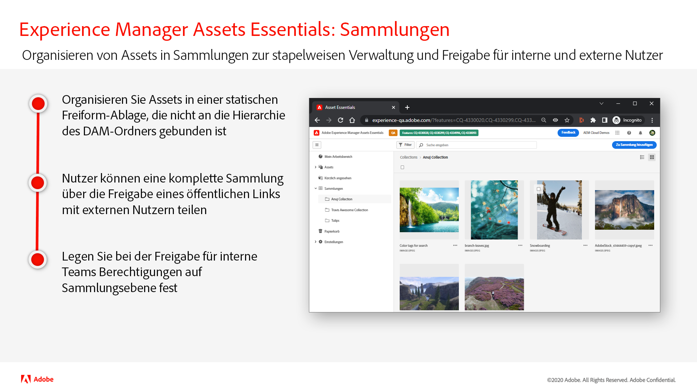
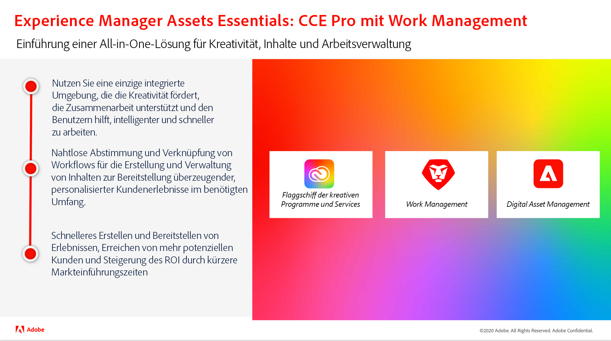
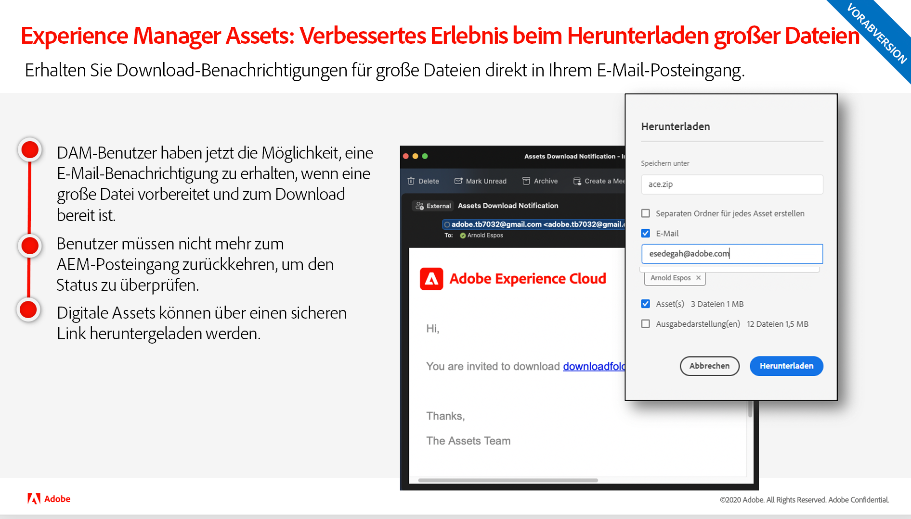
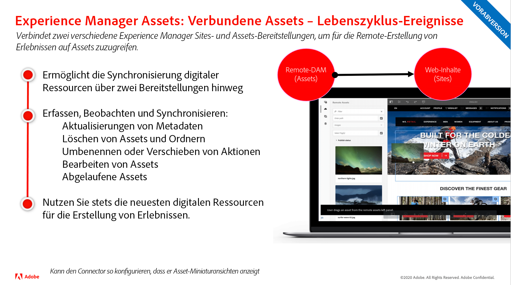

# Aktualisierungen zu Adobe Experience Manager as a Cloud Service-Versionen

Verschaffen Sie sich einen schnellen Überblick über die neuesten Funktionen in Adobe Experience Manager as a Cloud Service. Dies sind kurze, etwa 10-minütige Videos, die vom AEM-Produkt-Team bereitgestellt werden und über die Highlights der neuesten Version informieren.

## Neueste Aktualisierung

<!---

<table style="max-width: 50%;">
  <tr>
    <td>
      
      

        <a href="./2023/2023-1-0.md">
          <strong>Release | 2023.1.0</strong>
           
        </a>
          <em>Release date  Feb 2023 </em>
      

      

        <a href="https://experienceleague.adobe.com/docs/experience-manager-cloud-service/content/release-notes/release-notes/release-notes-current.html">Release notes</a>
      

    </td>
  </tr>  
</table> 

## Past Updates

<table style="max-width: 50%;">
  <tr>
    <td>
      
      

        <a href="./2022/2022-10-0.md">
          <strong>Release | 2022.10.0</strong>
           
        </a>
          <em>Release date  Oct 13, 2022 </em>
      

      

        <a href="https://experienceleague.adobe.com/docs/experience-manager-cloud-service/content/release-notes/release-notes/release-notes-current.html">Release notes</a>
      

    </td>  
    <td>
      
      

        <a href="./2022/2022-8-0.md">
          <strong>Release | 2022.8.0</strong>
           
        </a>
          <em>Release date  Sept 1, 2022 </em>
      

      

        <a href="https://experienceleague.adobe.com/docs/experience-manager-cloud-service/content/release-notes/release-notes/release-notes-current.html">Release notes</a>
      

    </td>
    <td>
      
      

        <a href="./2022/2022-7-0.md">
          <strong>Release | 2022.7.0</strong>
           
        </a>
          <em>Release date  Aug 8, 2022 </em>
      

      

        <a href="https://experienceleague.adobe.com/docs/experience-manager-cloud-service/content/release-notes/release-notes/release-notes-current.html">Release notes</a>
      

    </td>
  </tr>
  <tr> 
    <td>
      
      

        <a href="./2022/2022-6-0.md">
          <strong>Release | 2022.6.0</strong>
           
        </a>
          <em>Release date  June 30, 2022 </em>
      

      

        <a href="https://experienceleague.adobe.com/docs/experience-manager-cloud-service/content/release-notes/release-notes/release-notes-current.html">Release notes</a>
      

    </td>
    <td>
      
      

        <a href="./2022/2022-5-0.md">
          <strong>Release | 2022.5.0</strong>
           
        </a>
          <em>Release date  June 9, 2022 </em>
      

      

        <a href="https://experienceleague.adobe.com/docs/experience-manager-cloud-service/content/release-notes/release-notes/release-notes-current.html">Release notes</a>
      

    </td>
    <td>
      
      

        <a href="./2022/2022-4-0.md">
          <strong>Release | 2022.4.0</strong>
           
        </a>
          <em>Released  May 5, 2022 </em>
      

      

        <a href="https://experienceleague.adobe.com/docs/experience-manager-cloud-service/content/release-notes/release-notes/release-notes-current.html">Release notes</a>
      

    </td>
  </tr>
  <tr> 
    <td>
      
      

        <a href="./2022/2022-3-0.md">
          <strong>Release | 2022.3.0</strong>
           
        </a>
          <em>Released  March 31, 2022 </em>
      

      

        <a href="https://experienceleague.adobe.com/docs/experience-manager-cloud-service/content/release-notes/release-notes/release-notes-current.html">Release notes</a>
      

    </td>
    <td>
      
      

        <a href="./2022/2022-1-0.md">
          <strong>Release | 2022.1.0</strong>
           
        </a>
          <em>Released  February 3, 2022 </em>
      

      

        <a href="https://experienceleague.adobe.com/docs/experience-manager-cloud-service/content/release-notes/release-notes/2022/release-notes-2022-1-0.html">Release notes</a>
      

    </td>
    <td>
      
      

      <a href="./2021/2021-11-0.md">
          <strong>Release | 2021.11.0</strong>
           
        </a>
      <em>Released  December 16, 2021</em>
      

      

        <a href="https://experienceleague.adobe.com/docs/experience-manager-cloud-service/content/release-notes/release-notes/2021/release-notes-2021-11-0.html">Release notes</a>
      

    </td>
  </tr>
</table>

--->

<table style="max-width: 50%;">
  <tr>
    <td>
      
      

        <a href="./2022/2022-10-0.md">
 <strong>Freigabe | 2022.10.0</strong>
  
 </a>
 <em>Freigabedatum 13. Oktober 2022 </em>
      

      

        <a href="https://experienceleague.adobe.com/docs/experience-manager-cloud-service/content/release-notes/release-notes/release-notes-current.html?lang=de">Versionshinweise</a>
      

    </td>
  </tr>  
</table>

## Frühere Updates

<table style="max-width: 50%;">
  <tr>
    <td>
      
      

        <a href="./2022/2022-8-0.md">
          <strong>Version | 2022.8.0</strong>
           
        </a>
          <em>Veröffentlichungsdatum 1. September 2022 </em>
      

      

        <a href="https://experienceleague.adobe.com/docs/experience-manager-cloud-service/content/release-notes/release-notes/release-notes-current.html?lang=de">Versionshinweise</a>
      

    </td>
    <td>
      
      

        <a href="./2022/2022-7-0.md">
          <strong>Version | 2022.7.0</strong>
           
        </a>
          <em>Veröffentlichungsdatum 8. August 2022</em>
      

      

        <a href="https://experienceleague.adobe.com/docs/experience-manager-cloud-service/content/release-notes/release-notes/release-notes-current.html?lang=de">Versionshinweise</a>
      

    </td>
    <td>
      
      

        <a href="./2022/2022-6-0.md">
          <strong>Version | 2022.6.0</strong>
         
      </a>
        <em>Veröffentlichungsdatum: 30. Juni 2022 </em>
      

      

        <a href="https://experienceleague.adobe.com/docs/experience-manager-cloud-service/content/release-notes/release-notes/release-notes-current.html?lang=de">Versionshinweise</a>
      

    </td>
  </tr>
  <tr>  
    <td>
      
      

        <a href="./2022/2022-5-0.md">
          <strong>Version | 2022.5.0</strong>
         
      </a>
        <em>Veröffentlichungsdatum: 9. Juni 2022 </em>
      

      

        <a href="https://experienceleague.adobe.com/docs/experience-manager-cloud-service/content/release-notes/release-notes/release-notes-current.html?lang=de">Versionshinweise</a>
      

    </td>
    <td>
      
      

        <a href="./2022/2022-4-0.md">
          <strong>Version | 2022.4.0</strong>
         
      </a>
        <em>Veröffentlichungsdatum: 5. Mai 2022 </em>
      

      

        <a href="https://experienceleague.adobe.com/docs/experience-manager-cloud-service/content/release-notes/release-notes/release-notes-current.html?lang=de">Versionshinweise</a>
      

    </td>
    <td>
      
      

        <a href="./2022/2022-3-0.md">
          <strong>Version | 2022.3.0</strong>
         
      </a>
        <em>Veröffentlichungsdatum: 31. März 2022 </em>
      

      

        <a href="https://experienceleague.adobe.com/docs/experience-manager-cloud-service/content/release-notes/release-notes/release-notes-current.html?lang=de">Versionshinweise</a>
      

    </td>
  </tr>
  <tr>     
    <td>
      
      

        <a href="./2022/2022-1-0.md">
          <strong>Version | 2022.1.0</strong>
         
      </a>
        <em>Veröffentlichungsdatum: 3. Februar 2022 </em>
      

      

        <a href="https://experienceleague.adobe.com/docs/experience-manager-cloud-service/content/release-notes/release-notes/2022/release-notes-2022-1-0.html?lang=de">Versionshinweise</a>
      

    </td>
    <td>
      
      

      <a href="./2021/2021-11-0.md">
          <strong>Version | 2021.11.0</strong>
         
      </a>
    <em>Veröffentlichungsdatum: 16. Dezember 2021</em>
      

      

        <a href="https://experienceleague.adobe.com/docs/experience-manager-cloud-service/content/release-notes/release-notes/2021/release-notes-2021-11-0.html?lang=de">Versionshinweise</a>
      

    </td>
  </tr>
</table>
